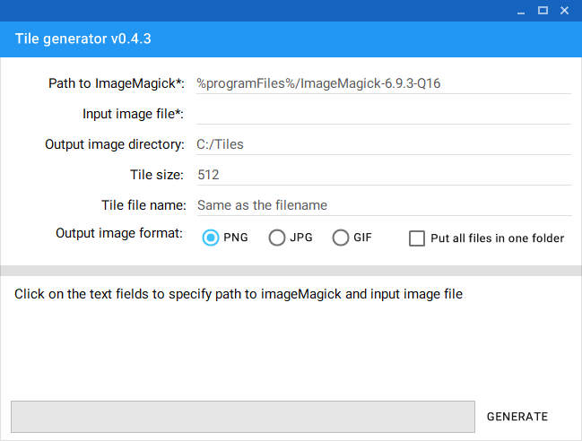

# tile-generator
Windows app that generates tiles from an image using ImageMagick

## Usage

- Download this repository
- Install ImageMagick for windows and remember installation path
- Open `TileGenerator/bin/Release/`
- Launch TileGenerator.exe
